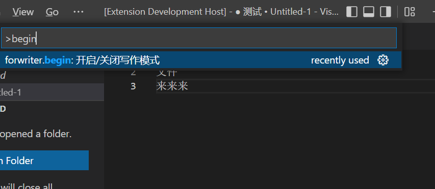

# forwriter README

- [forwriter README](#forwriter-readme)
  - [开启](#开启)
  - [功能](#功能)
    - [字数统计功能](#字数统计功能)
    - [书卷内容复制](#书卷内容复制)
    - [书卷标记（待完成）](#书卷标记待完成)
    - [视图](#视图)
      - [章节视图](#章节视图)

## 开启

输入命令write，启动写作模式

## 功能

### 字数统计功能

在开启插件的情况下，可以随时读取编辑区的字数并显示在下边栏

### 书卷内容复制

在开启插件的情况下，可以使用书卷内容复制功能，复制过程中会排除书卷标记的部分，只复制正文。

### 书卷标记（待完成）

可以在书卷中插入一些标记，比如（// 计划在此处加入露西的情感描写）

书卷标记可以从左侧的树状图中直接查看到

### 视图

#### 章节视图

能在树状图中看到所有的章节
